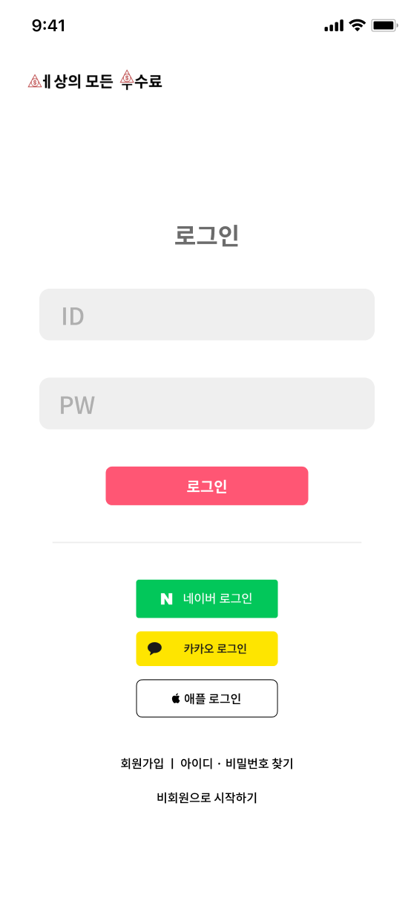
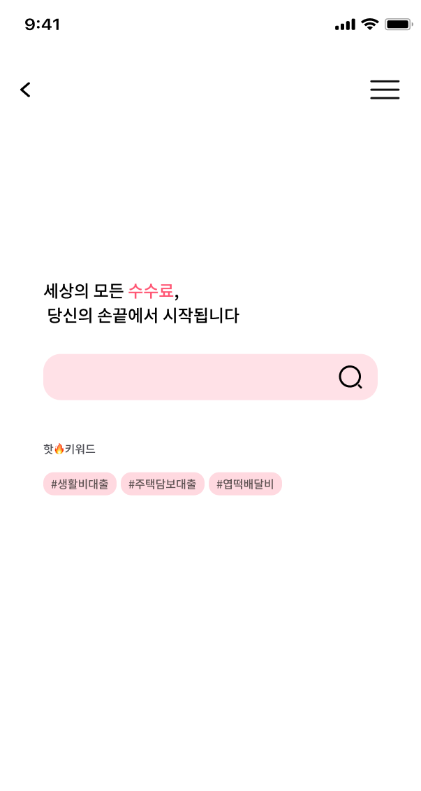
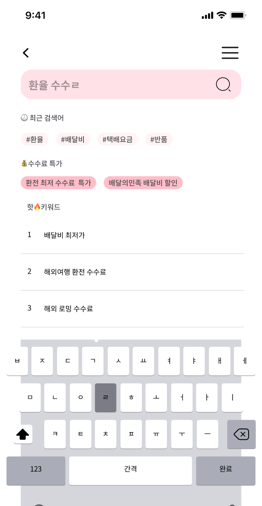
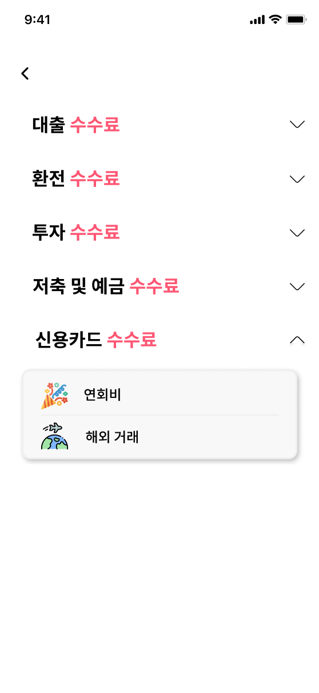

# 세상의 모든 수수료 : 세모수

 

## 세모수 서비스 개요

 

<!-- ## 기능 소개 -->

### 서비스 화면

  

    
    
<em>로그인 페이지</em>

  

  

    
    
<em>검색 페이지</em>

  

  

    
    
<em>검색 페이지2</em>

  

  

    
    
<em>결과 페이지</em>

  

  

    
    
<em>카테고리 페이지</em>

  

